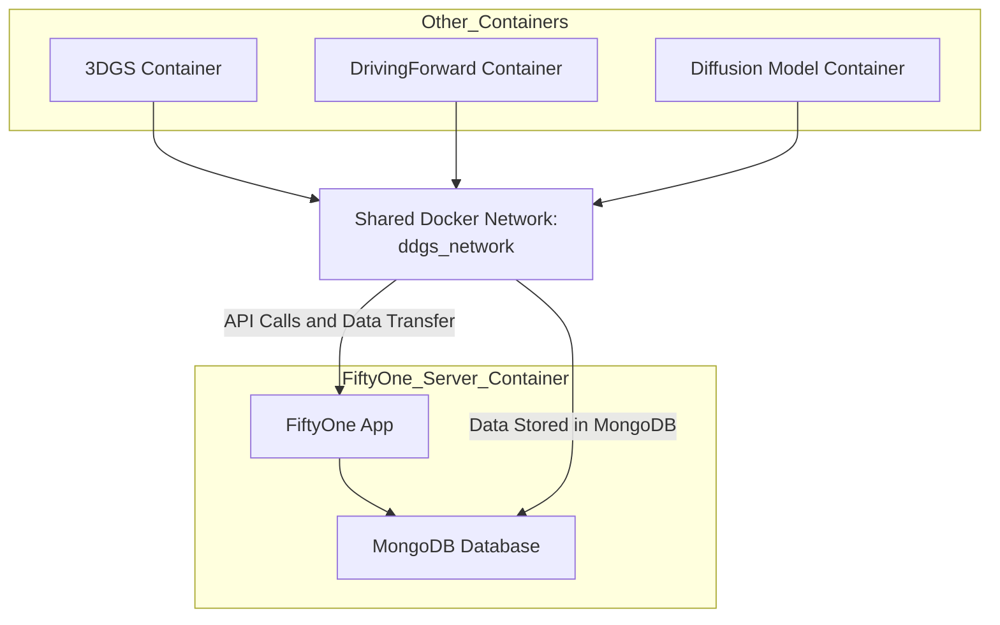

# Dataset Containers 

## General Architecture Diagram



## Setup

### 1. Create the Docker network (if not already existing)

To allow containers to communicate with each other:

```bash
docker network create dggs_network
```

---

### 2. Build and start the services with Docker Compose

```bash
docker-compose up --build -d
```

This will:

* Start a MongoDB container (`nuscenes_mongo_db`) to store FiftyOne metadata
* Start a developer container (`fiftyone_worker`) with FiftyOne and official plugins
* Mount your datasets and workspace for live development
* Configure dataset downloads to `/datastore/fiftyone`

---

### 3. Connecting Other Containers

Other containers (e.g., for training, analysis, or visualization) can connect to the shared MongoDB using:

```bash
docker run --name <your_container_name> \
  -v $(pwd):/workspace \
  -v /datastore:/datastore \
  --shm-size=16g \
  -it --gpus all \
  --network dggs_network \
  -e FIFTYONE_DATABASE_URI=mongodb://nuscenes_mongo_db:27017 \
  <your_image_name>
```

Replace `<your_container_name>` and `<your_image_name>` with your desired names.
This ensures shared access to datasets and centralized metadata.

